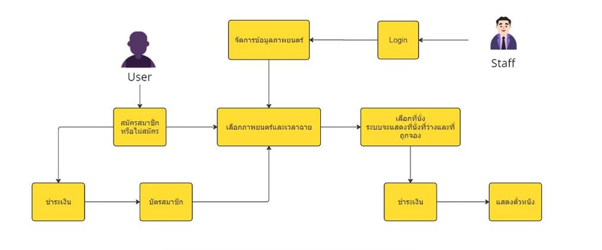
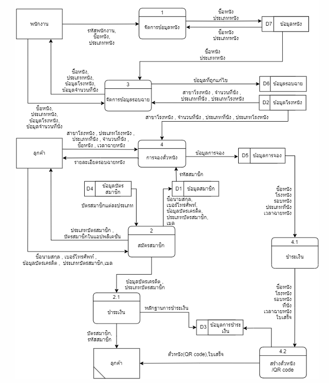
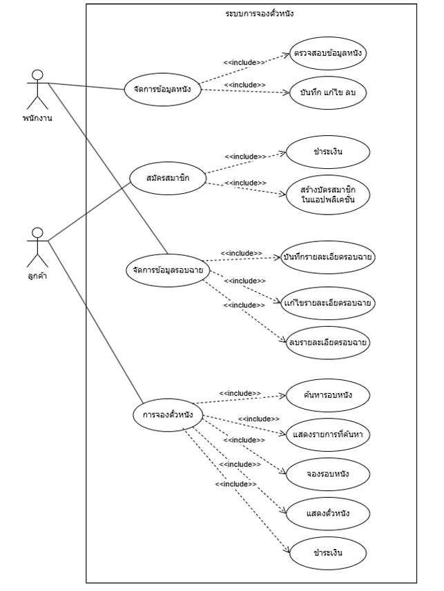
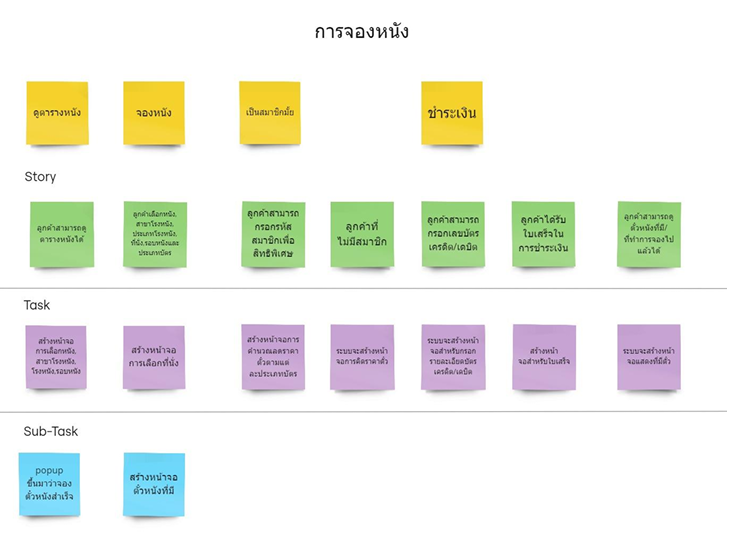
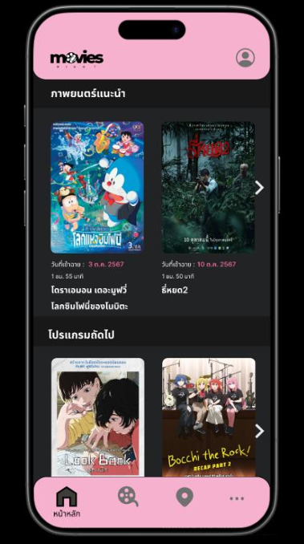
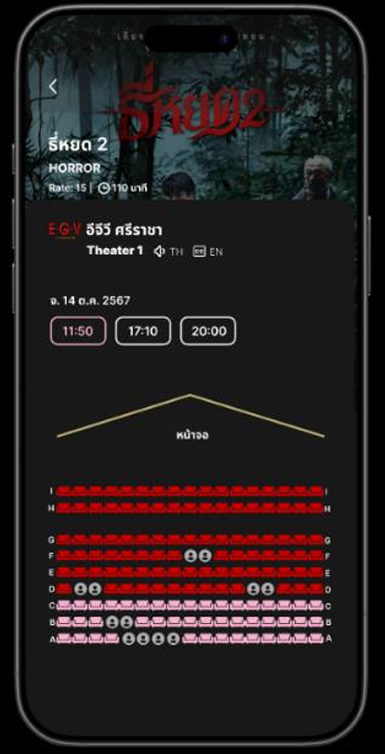
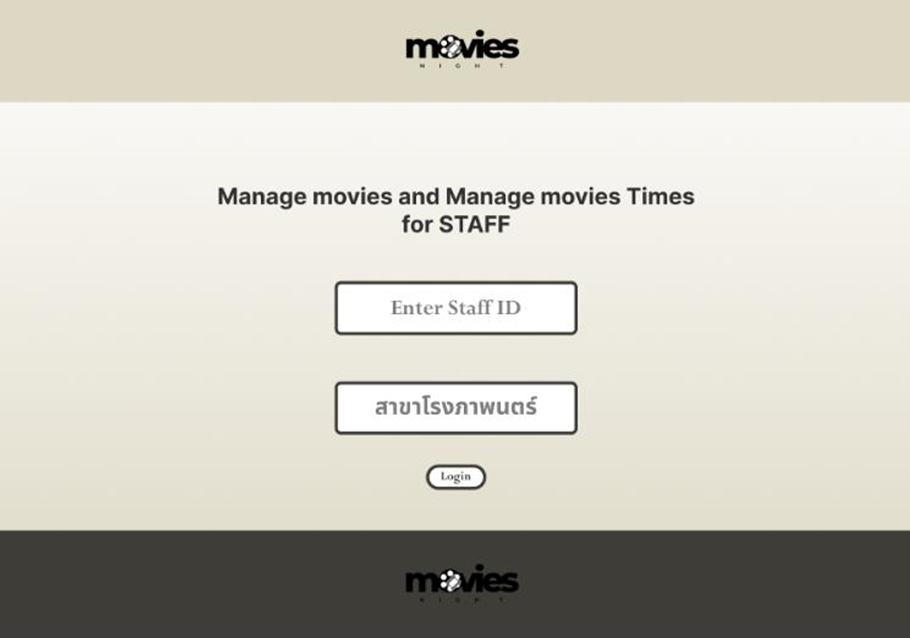

# Movie Night – Online Movie Ticket Booking System

A system analysis and design project for an online movie ticket booking application. This project focuses on requirement analysis, system design, user flows, and interface design for both customer and staff sides.

## Figma Prototype
[View Figma Design](https://www.figma.com/design/nXPFF0AOdBq5VMnbcxUEwh/MovieNight_User?node-id=0-1&p=f)

## Overview
Movie Night is an online movie ticket booking system designed to make ticket booking more convenient, faster, and more accurate for users. The system supports movie browsing, showtime viewing, seat booking, payment, membership registration, and staff-side management for movies and showtimes.

## Objectives
- Design an online movie ticket booking system that is convenient and easy to use
- Reduce errors in ticket booking and improve booking efficiency
- Support real-time booking-related information
- Improve both customer experience and system management workflow

## My Role
- Contributed to system analysis and design
- Worked on requirement analysis and project scope definition
- Helped create system design artifacts such as DFD, Use Case, User Story, Class Diagram, Activity Diagram, State Diagram, and Sequence Diagram
- Participated in UI design and application flow planning
- Collaborated as part of a team project in the System Analysis and Design course

## Project Scope
The system was designed for multiple user roles:
- Guest users can search movies, view cinema information, and check showtimes
- Registered users can sign up, book tickets, make payments, manage bookings, and view booking history
- Staff can manage movie information and showtime data

The system also includes automatic functions such as:
- real-time seat and booking updates
- booking confirmation by email
- payment processing
- receipt generation

## Key Features
- Movie search and showtime browsing
- Online movie ticket booking
- Seat selection
- Membership registration
- Payment workflow
- Booking confirmation and receipt
- Staff-side movie management
- Staff-side showtime management

## System Design Artifacts
This project includes analysis and design work such as:
- System Overview
- Data Flow Diagram (DFD)
- Data Dictionary
- Use Case Diagram
- User Story
- Class Diagram
- Activity Diagram
- State Diagram
- Sequence Diagram
- UI design / application screens

## Tools Used
- Figma
- System analysis and design documentation
- Diagram-based modeling techniques

## Screenshots

### System Overview

### DFD Level 1

### Use Case Diagram

### User Story – Movie Booking

### Home Page

### Seat Booking Page

### Staff Movie Management

## Notes
This repository is intended for portfolio and educational showcase purposes. It focuses on system analysis, design, and interface planning rather than a public production deployment.

## Project Status
Academic Project  
System Analysis and Design Course  
Kasetsart University Sriracha Campus
